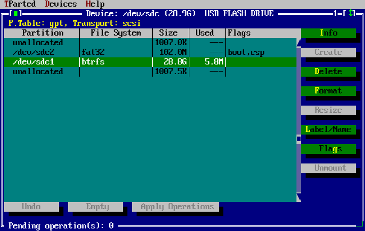
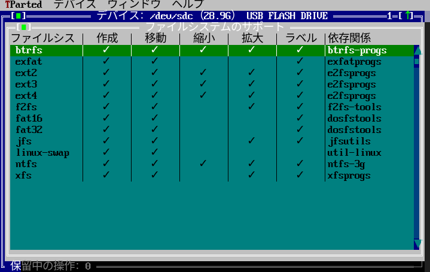

# tparted

TUI frontend for `parted`: A simple, user-friendly utility for creating, moving, resizing, and deleting disk partitions, based on Free Vision application framework.

MBR is partially supported, as long as no extended partition found on the device.

Currently supported filesystems:

| | Create | Move | Shrink | Grow | Label |
|-|-|-|-|-|-|
| btrfs | :heavy_check_mark: | :heavy_check_mark: | :heavy_check_mark:* | :heavy_check_mark:* | :heavy_check_mark: |
| ext2 | :heavy_check_mark: | :heavy_check_mark: | :heavy_check_mark: | :heavy_check_mark: | :heavy_check_mark: |
| ext3 | :heavy_check_mark: | :heavy_check_mark: | :heavy_check_mark: | :heavy_check_mark: | :heavy_check_mark: |
| ext4 | :heavy_check_mark: | :heavy_check_mark: | :heavy_check_mark: | :heavy_check_mark: | :heavy_check_mark: |
| exfat | :heavy_check_mark: | :heavy_check_mark: | | | :heavy_check_mark: |
| f2fs | :heavy_check_mark: | :heavy_check_mark: | | :heavy_check_mark: | :heavy_check_mark: |
| fat16 | :heavy_check_mark: | :heavy_check_mark: | | | :heavy_check_mark: |
| fat32 | :heavy_check_mark: | :heavy_check_mark: | | | :heavy_check_mark: |
| jfs | :heavy_check_mark: | :heavy_check_mark: | | :heavy_check_mark: | :heavy_check_mark: |
| linux-swap | :heavy_check_mark: | :heavy_check_mark: | | | |
| ntfs | :heavy_check_mark: | :heavy_check_mark: | :heavy_check_mark: | :heavy_check_mark: | :heavy_check_mark: |
| xfs | :heavy_check_mark: | :heavy_check_mark: | | :heavy_check_mark: | :heavy_check_mark: |

*In case of btrfs, for now the app doesn't deal with multi disk array.

## Install

#### Pre-built binary
- See `Releases` section.

#### Archlinux User Repository (AUR)
- Run `git clone https://aur.archlinux.org/tparted-bin.git`, then enter `tparted-bin` directory and run `makepkg -si`
- Alternatively you can use an AUR helper, like `paru -S tparted-bin` or `yay -S tparted-bin`

#### Building from source
- Since the app requires Unicode version of Free Vision, you need to have Free Pascal (beta 3.3.1) or later beta version installed on the system.
- Run `make build` to build the app. The binary is located in `./bin` directory.
- Run `make install` to install the app to `/usr/bin`

#### Translation
- The app is capable of loading translation files in `.mo` format. Simply translate the default `en_US.po` file to your language of choice, convert it to the `.mo` format via `msgfmt` tool, then place the converted file into the `./bin/locale` directory.
- The app depends on the `LANG` environment variable to determine the language. For example, the app will try to load `ja_JP.mo` or `ja.mo` if `LANG=ja_JP.UTF-8`.

## Dependencies
- `parted`
- `util-linux`
- `sfdisk` (optional) for moving partitions.
- `dosfstools` (optional) for fat operations.
- `exfatprogs` (optional) for exfat operations.
- `e2fsprogs` (optional) for ext2/3/4 operations.
- `ntfs-3g` (optional) for ntfs operations.
- `btrfs-progs` (optional) for btrfs operations.
- `xfsprogs` (optional) for xfs operations.
- `jfsutils` (optional) for jfs operations.
- `f2fs-tools` (optional) for f2fs operations.

