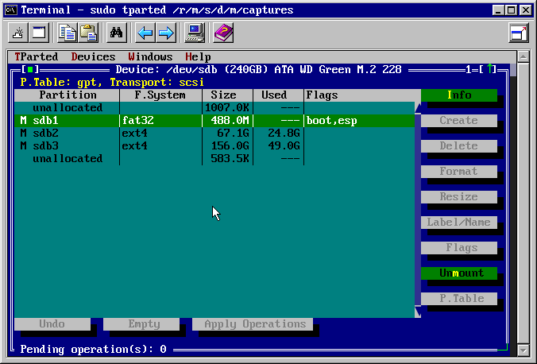

# tparted

TUI frontend for `parted`, an utility for creating, reorganizing, and deleting (for now) GPT disk partitions, based on Free Vision application framework.

The app is currently in beta state, thus critical bugs can occur at any times.

Supported filesystems:

| | Create | Delete | Format | Move | Resize | Label | Flags |
|-|-|-|-|-|-|-|-|
| Ext2 | :heavy_check_mark: | :heavy_check_mark: | :heavy_check_mark: | :heavy_check_mark: | :heavy_check_mark: | :heavy_check_mark: | :heavy_check_mark: |
| Ext3 | :heavy_check_mark: | :heavy_check_mark: | :heavy_check_mark: | :heavy_check_mark: | :heavy_check_mark: | :heavy_check_mark: | :heavy_check_mark: |
| Ext4 | :heavy_check_mark: | :heavy_check_mark: | :heavy_check_mark: | :heavy_check_mark: | :heavy_check_mark: | :heavy_check_mark: | :heavy_check_mark: |
| Swap | :heavy_check_mark: | :heavy_check_mark: | :heavy_check_mark: | | | | :heavy_check_mark: | :heavy_check_mark: |
| Fat16 | :heavy_check_mark: | :heavy_check_mark: | :heavy_check_mark: | | | :heavy_check_mark: | :heavy_check_mark: |
| Fat32 | :heavy_check_mark: | :heavy_check_mark: | :heavy_check_mark: | | | :heavy_check_mark: | :heavy_check_mark: |
| NTFS | :heavy_check_mark: | :heavy_check_mark: | :heavy_check_mark: | | | :heavy_check_mark: | :heavy_check_mark: |
| BTRFS | :heavy_check_mark: | :heavy_check_mark: | :heavy_check_mark: | | | | :heavy_check_mark: |

## Install

#### Pre-build binary
- See `Releases` section.

#### Building from source
- Since the app requires Unicode version of Free Vision, you need to have Free Pascal 3.3.1 installed on the system.
- Run `make build` to build the app. The binary is located in `./bin` directory.
- Run `make install` to install the app to `/usr/bin`

## Dependencies
- `parted`
- `sfdisk` for Move operations.

